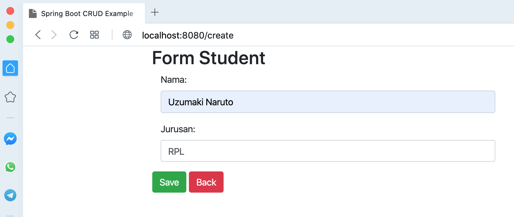
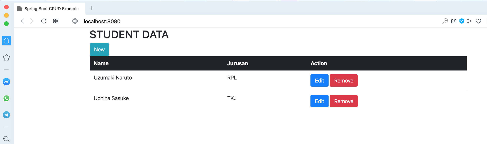

# springboot-thymeleaf-postgres

### Things to do
1. Clone the repository: `git clone https://github.com/hendisantika/springboot-thymeleaf-postgres.git`.
2. Go to folder: `cd springboot-thymeleaf-postgres`
3. Run application: `mvn clean spring-boot:run`

### Screen shot





### Kubernetes Command

```shell
kubectl apply -f k8s/postgres-configmap.yml
kubectl get configmap
kubectl apply -f k8s/postgres-credentials.yml
kubectl get secret
kubectl describe secret postgres-credentials
```

### execute file deployment postgresql database.

```shell
kubectl apply -f k8s/postgres-deployment.yml
kubectl get deployment
kubectl get pod
kubectl logs -f postgres-77977dd68f-4dwjz
kubectl port-forward postgres-77977dd68f-4dwjz 5433:5432
```
